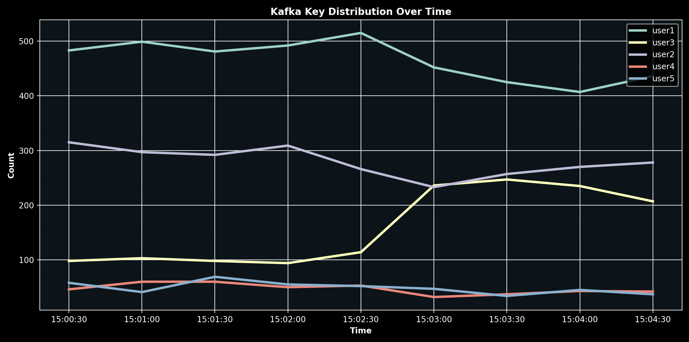
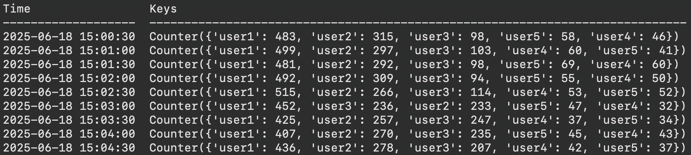

# Kool

#### Welcome to *Kool*, your friendly neighborhood *Kafka tool*!

## Description
Kool is a handy Kafka observability tool that shows the key distribution of Kafka messages within a given time span.

It's designed to help developers recognize anomalies in their data when investigating larger issues.

### Example Use Case
Imagine (God forbid!) our Kafka consumer starts accumulating a lag. 
The natural next step would be to check if the production rate to the topic has increased dramatically, 
which is relatively easy to see using standard Kafka exporter metrics. 
That could give us some interesting insight, but what if our topic contains records of multiple types, 
and we want to see if there happens to be a specific data type that's on the rise that our consumer takes longer to process?

This is where Kool comes in!

Kool displays a graph of the topic's key counts over time, 
allowing us to see if a certain key is showing a substantial increase in correlation with when the lag started.
This is especially significant in cases where the topic receives a very high percentage of keys that are easy to process 
but suddenly sees an increase in a lower-traffic but higher-process-time key.

## Getting Started
### Installation
```bash
uv sync
```

### CLI Usage Example
```bash
uv run kool adi 0 2025-06-18T15:00:30 2025-06-18T15:05:00
```


